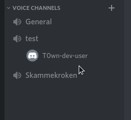
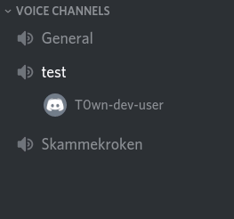

# DictatorBot

This is a personal discordbot used in my own discord server.

The idea behind the bot started as a joke. I wanted to prank my friends by keeping them trapped in a voice channel.
The bot achieves this by removing the roles and privileges of the user when he/she is moved into the voice channel named "Skammekroken" by an admin.
The target no longer has privileges to join or see other voice channels.
When an admin moves the target out of "Skammekroken" the bot will automatically give back roles and privileges.

Here is an example of how it looks for the users:

<table>
  <tr>
    <td>Admins perspective</td>
    <td>Users perspective</td>
  </tr>
  <tr>
    <td>  </td>
    <td>  </td>
  </tr>
</table>

Over time the bot has gotten more features, like logging, audioplaying and memeposting.

## Discord API
This project uses the discord [Javascript API](https://discord.js.org/#/) and [Python API wrapper](https://pypi.org/project/discord.py/).
